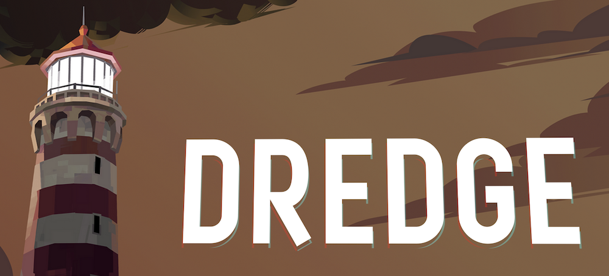
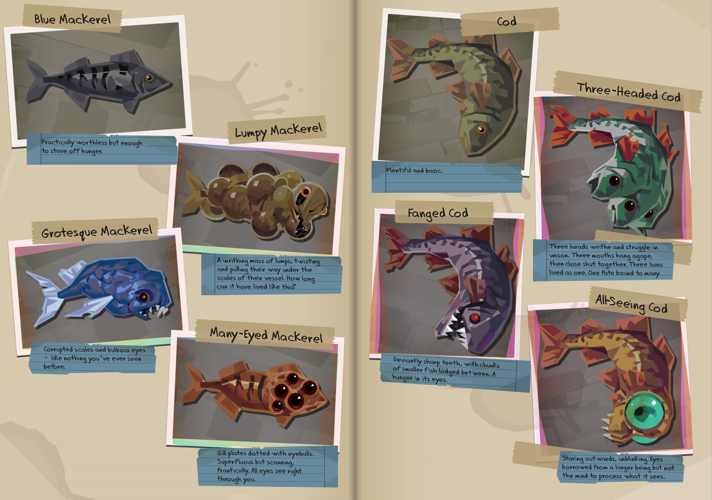
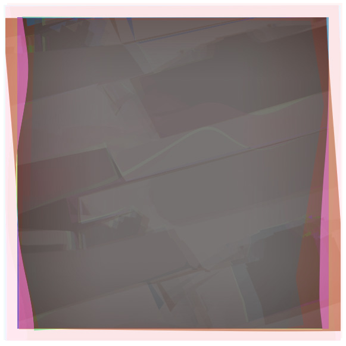
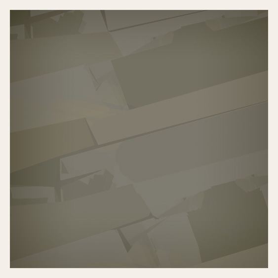
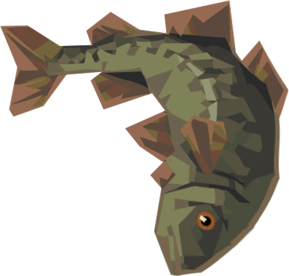
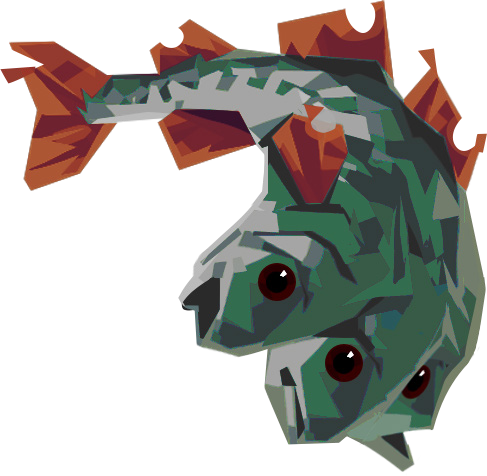
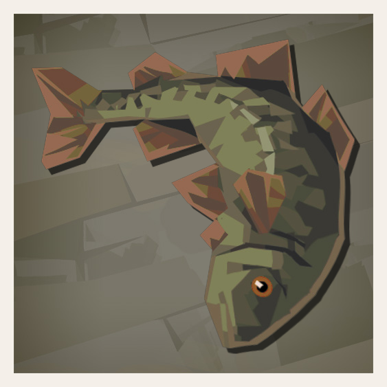
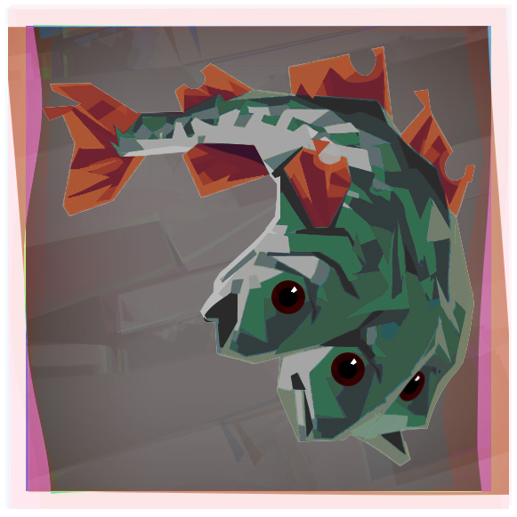

## Dredge Fish Species Notebook
<p align="middle">


</p>

### Description
The process to create a physical version of the digital Fish Species Notebook from [Dredge](https://www.dredge.game/)

### Image Extraction

The Notebook is a single PDF file, so we will use PDF image extractor to get specific fish images out of it:
```shell
./extract_images.sh fish.pdf dredge
```
The script uses ``pdfimages`` tools and ``ImageMagick`` to apply transparent mask back to images.
As a result, you will get one folder full of different images.
You will notice that fish images
Next, create the following directory structure:
```
📂 assets
├── 📂 aberration_bg
│   ├── horizontal_rect_abb.png
│   ├── square_abb.png
│   └── vertical_rect_abb.png
├── 📂 photos_aberrations
│   ├── image-xxx.png
│   └── ...
├── 📂 normal_bg
│   ├── horizontal_rect_normal.png
│   ├── square_normal.png
│   └── vertical_rect_normal.png
├── 📂 photos_normal
│   ├── image-xxx.png
│   └── ...
```
I have already added background directories to this repo:

<p align="middle">


</p>

The fish photos are not in this repo for potential copyright reasons.
Just added a "basic and plentiful" cod as an example:
<p align="middle">


</p>
So you need to manually move extracted fish images to their respective folders.

### Background Matching
Next, I prepared a python script that will accept background and raw image photo directories, and match the fish with background using the closest aspect ratio (it's not perfect but good enough): 

```shell
python3 dredge_bg_matcher.py assets/normal_bg assets/normal normal_fish_with_bg
python3 dredge_bg_matcher.py assets/aberration_bg assets/aberrations abb_fish_with_bg
```

After that, you should see the matched and combines photos in the output directories:
<p align="middle">


</p>

### Photo Printing
I have used my local photo printing shops (in Switzerland: Migros or ALDI Photos) with the following specs:
xxx
Results:

### Notebook
This is the most difficult part. I had imagined the following specifications:
* Hardcover
* Brown/Yellow/Orange cover
* 40 pages
* Liner or Blank
* Yellowish paper

This turned out to be extremely difficult. Currently, I have ordered this one from Amazon:

https://www.amazon.de/-/en/gp/product/B09FF7J2B3/ref=ppx_od_dt_b_asin_title_s00?ie=UTF8&psc=1

The cover is black and soft, but other parameters match well.